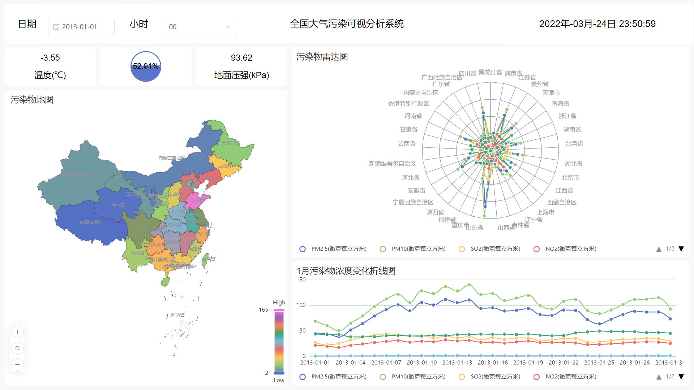

# ChinaVis 2021 数据可视化竞赛

## 引言

基于 ChinaVis 2021 数据可视化竞赛官方提供的**小时**数据集，完成数据可视化分析，并提交实验报告。

## 演示



## 安装

```bash
pip install -r requirements.txt
```

## 用法

## 数据处理

1. 从大赛官网下载**小时分析数据**

> [http://naq.cicidata.top:10443/chinavis/opendata](http://naq.cicidata.top:10443/chinavis/opendata)

2. 将数据分别解压放到 `source/hour` 文件夹中
3. 运行 `python script/0_reGeo.py` 进行逆地理编码
4. 运行 `python script/1_preprocessing.py` 进行预处理（请先在 `data` 目录下新建 `prepro/hour` 目录）
5. 运行 `python script/2_addDate.py`，处理好的年份数据会放到 `data/newpro` 目录里面

## 数据展示

由于上一步处理的数据还是太大，故这里只对 2013 年的数据进行可视化

1. 安装部署 DataEase 数据可视化分析平台

> 安装教程：[点击跳转](https://dataease.io/docs/installation/offline_installation_windows/)

2. 使用 `2013.xlsx` 数据制作可视分析图表

> 视频教程：[点击查看](video/tutorial.mp4)

3. 制作完成后备份作品为 `dataease.tar.gz`

> 备份教程：[点击查看](https://dataease.io/docs/faq/backup_faq/)

## 还原

如果将备份的可视化数据还原？在新环境中安装 [DataEase v1.8.0](https://community.fit2cloud.com/#/products/dataease/downloads)，用解压的 `dataease.tar.gz` 文件覆盖安装目录 ` /opt/dataease` 即可。

## 其他

> 仓库123云盘备份：[https://www.123pan.com/s/RKrRVv-jypJH](https://www.123pan.com/s/RKrRVv-jypJH)

## 参考

> [http://www.chinavis.org/2021/challenge.html](http://www.chinavis.org/2021/challenge.html)
